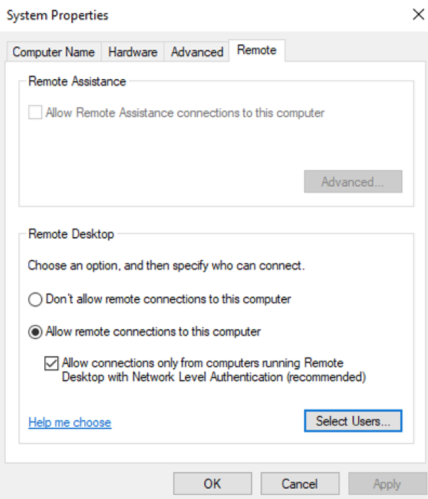

# Azure-Windows-Sysadmin-Assignment
A day in the life of a Windows Sysadmin

**Note:  based on research, there is issue relate to the Hyper-V manager:  if we cannot login the windows 10 vm as domain users even if the domain users granted RDP permission, we need to click ‘view’ option on the top bar of the vm window, then uncheck the ‘Advanced Session’ option. Now, we should be able to login as domain users.**

### Task 1:  Create an Account Lockout GPO

According to the document of Configuring Account Lockout from Microsoft, there are pros and cons of creating an account lockout GPO. One of the most important pros is that to set up account lockout GPO can prevent users’ passwords getting attacked easily, especially for the brute force password-guessing attacks. One of the significant cons is that the account lockout GPO may lock users, expose the organization to accidental lockouts, or permanently accidentally; it can also cause DoS attacks to the companies.
Before setting up the account lockout GPO, we need to consider the baseline and tradeoffs of this GPO. There are three settings can complete the account lockout configuration:

- Account lockout threshold
- Account lockout duration
- Reset account lockout counter after

To set up the account lockout GPO, we need to design a good combination for these three values. However, depends on the structure, situations, and other factors of the organizations, the setting of account lockout may vary.
If the lockout threshold is set high, it may not really help to protect the users’ password from attacking; it is set to low, the chance to lockout accidental will be significantly increased, which will bring more extra work to the service desk as well as it will affect employees work efficiency. If the account lockout duration is set too large, it will definitely affect users’ work if they were lockout accidentally; if the account lockout duration is set too short, it can lead to the continuous lockout when attackers maintain a sustained attack. The reset account lockout counter after is similar to the account lockout duration setting. We can always combine account lockout GPO with other password policies to harden the password and reduce the need for account lockout.
In this task, I would like to choose the Microsoft recommended settings for the account lockout GPO, which is 10/15/15. These three number means the threshold for bad attempts is 10, a 15-minutes lockout duration, the bad-logon counter will be reset after 15 minutes.

Click ‘Tools’ on the top right bar in the server manager window screen, select ‘Group Policy Management’, then create a new GPO for our GC domain → Computer Configuration → Windows Settings → Security Settings → Account Policies → Account Lockout Policy

Change settings for all three policies here:

- Account lockout threshold to 10 invalid logon attempts
- Account lockout duration to 15 mins
- Reset account lockout counter after 15 mins

Run the ‘Command Prompt’ as Administrator → type command ‘gpupdate /force’ to update GPO

To verify the GPO has been applied to the GC computer OU

### Task 2:  Create a File Share for the Developers

Since there is no ‘Development’ OU in domain goodcorp.net, we need to follow the guide we learned from class to create an OU named ‘Development’ for the developers; then create a new user named Andrew who works for the development team.

1. With the Server Manager open, click on Tools at the top-right.
2. Select the Active Directory Users and Computers (ADUC) tool.
3. With ADUC open, do the following:
  - Right-click GC Users under GOODCORP.NET, go to New, then Organizational Unit.
  - Name this sub-OU Development.
  
4. Create a new user named Andrew for OU Development, create a group named Development for OU Development.
5. Add Andrew into the group Development.

Followed the guide to create a shared file named ‘dev’ in Windows Server VM:
1. In the Server Manager click on File and Storage Services.
2. Click on the Shares tab to show current shared files and folders.
3. Click on TASKS then New Share to the right of Shares | all shares.
4. On the Select the profile for this share, make sure SMB Share - Quick is highlighted and click ‘Next >’.
5. On the Select the server and path for this share window, Click Next >.
6. On the Specify share name window, for the Share name: enter ‘dev’. Click Next >.
7. On the Configure share settings, check Enable access-based enumeration and leave Allow caching of share checked. Click Next >.
8. On the Specify permissions to control access, click Customize permissions....
  - On the Advanced Security Settings for Development window, do the following:
    - Click Add.
    - On the Permission Entry for Development window, Select a principal, enter Development, click Check Names, then click OK.
    - Check Write, click OK.
    

The Development group is now added to the Permission entries list.

You never want to assign single users to a resource. We always want to assign groups to resources. This allows us to more efficiently manage permissions.

9. Click Disable inheritance, pick -> Convert inherited permissions into explicit permissions on this object.

10. Remove both Users (GOODCORP\Users) permissions. The only ones left should be: Administrators, SYSTEM, CREATOR OWNER, and Sales (GOODCORP\Development).

Understand that not all domain users won't be able to access this share and that only users in the Development group can.

11. Click Apply and OK to exit the Advanced Security Settings for Development window.
12. Click Next >.
13. On the Confirm selections screen, click Create.
14. Click Close after it's done creating.

Since we ask the new created domain user Andrew to change password when he first time login the system.

Open the file explorer and test the new file share by replacing the current navigation URL to \\WIN-4NMH1RF1JT5.goodcorp.net\dev.

Because we don’t have anything files in the shared sholder ‘dev’, it shows ‘This folder is empty’. The screenshot below:

To verify the shared folder is created successfully, we can go to ‘This PC → C:\ drive → Shares’, there are created share folder for each department. I combined this task ‘dev’ and the bonus one ‘Sales’ in the same screenshot below:

- Bonus 1:  Login as GoodCorp\Bob and attempt to access all file shares (since we create b.smith as Bob’s login username in the class, the screenshots and commands will run with ‘b.smith’ instead of Bob in this task)

The screenshots are to illustrate how to add file share for the Sales department (same steps I did for ‘dev’ in task 2)

Need to enable the ‘Remote Desktop’ option in the local server option to enable domain users to login to the machines.

Login as Bob (b.smith) on the windows 10 VM, access \\WIN-4NMH1RF1JT5.goodcorp.net\Sales without any permission denied. However, if Bob wants to access the  \\WIN-4NMH1RF1JT5.goodcorp.net\dev, there is an error window popup because Bob is not in the group of Development so that Bob doesn’t have access to the dev shared folder. The same error will occur when Andrew tries to access ‘Sales’ shared folder. 

- Bonus 2:  Comparing SIDS for the Sales and Dev Teams

Login as Andrew on the Windows 10 VM, since Andrew doesn’t have permission to access Sales group, there is an error occurs when Andrew tried to access ACL of Sales shared folder.

Since both Bob (b.smith) and Andrew, Sales and Development group are all in the same domain; they are domain users, groups, we can run the commands to check their shared folder’s ACL, principal group membership (SIDs).

### Task 3:  Create a logon script GPO

Create a new folder named ‘Projects’ in the ‘dev’ fileshare directory.

To verify this task to login the windows 10 VM as Andrew, since Andrew is in group Development

